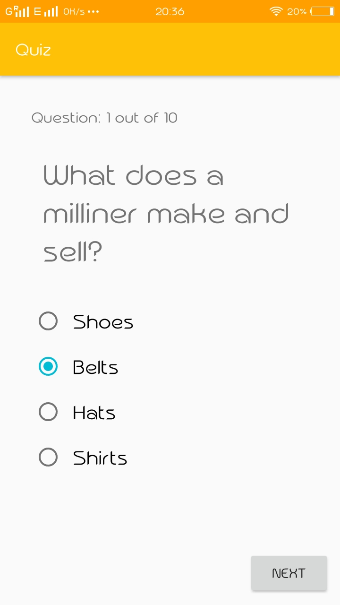
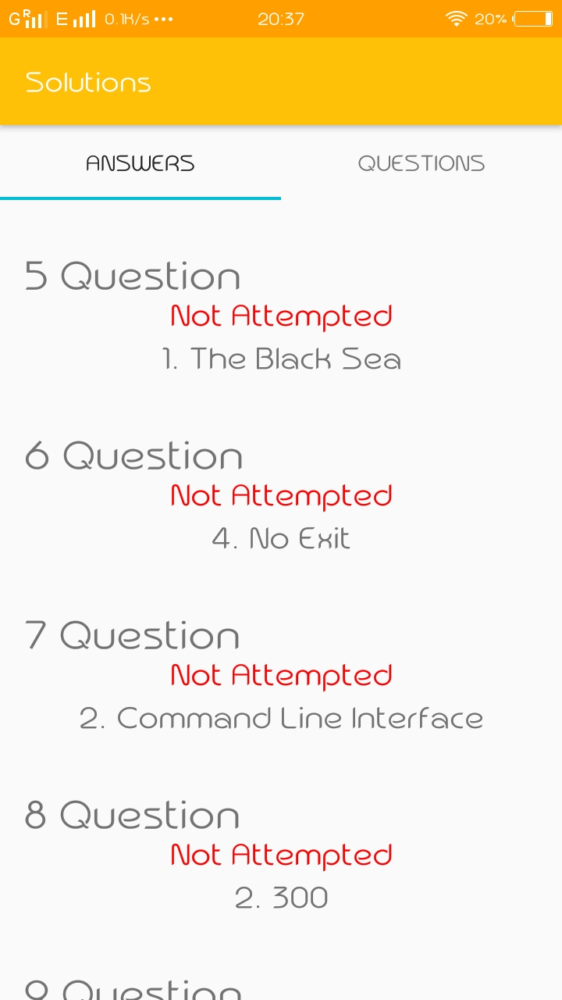

# Quiz Android App

[](https://gitter.im/immadisairaj/Quiz?utm_source=badge&utm_medium=badge&utm_campaign=pr-badge&utm_content=badge)

## Communication

Our chat channel is on gitter [here](https://gitter.im/immadisairaj/Quiz)

## Development

A native Android app using Java for writing code.

### Installing

- Fork the repository. 
- Clone the repo using the terminal command. Make sure you replace `username` with your GitHub username.
```bash
git clone https://github.com/username/Quiz.git 
```

### Setting up the Android Project

1. Download the Quiz project source. You can do this either by forking and cloning the repository (recommended if you plan on pushing changes) or by downloading it as a ZIP file and extracting it.

2. Open Android Studio, you will see a Welcome to Android window. Under Quick Start, select _Import Project (Eclipse ADT, Gradle, etc.)_

3. Navigate to the directory where you saved the susi_android project, select the root folder of the project (the folder named "Quiz"), and hit OK. Android Studio should now begin building the project with Gradle.

4. Once this process is complete and Android Studio opens, check the Console for any build errors.

  - _Note:_ If you receive a Gradle sync error titled, "failed to find ...", you should click on the link below the error message (if avaliable) that says _Install missing platform(s) and sync project_ and allow Android studio to fetch you what is missing.

5. Once all build errors have been resolved, you should be all set to build the app and test it.

6. To Build the app, go to _Build>Make Project_ (or alternatively press the Make Project icon in the toolbar).

7. If the app was built successfully, you can test it by running it on either a real device or an emulated one by going to _Run>Run 'app'_ or pressing the Run icon in the toolbar.


### Libraries used and their documentation

- Retrofit [Docs](http://square.github.io/retrofit/2.x/retrofit/)
- Butter Knife [Docs](https://github.com/JakeWharton/butterknife/)
- GSON Converter [Docs](https://github.com/square/retrofit/tree/master/retrofit-converters/gson/)

### API Used

Open Trivia [Docs](https://opentdb.com/api_config.php/)

Used Encoding `encode=url3986`


## Screenshots

<table>
  <tr>
    <td></td>
    <td></td>
    <td></td>
  </tr>
</table>

## Built With
- Android Studio (version: 3.2.1)
- Ubuntu 18.O4
